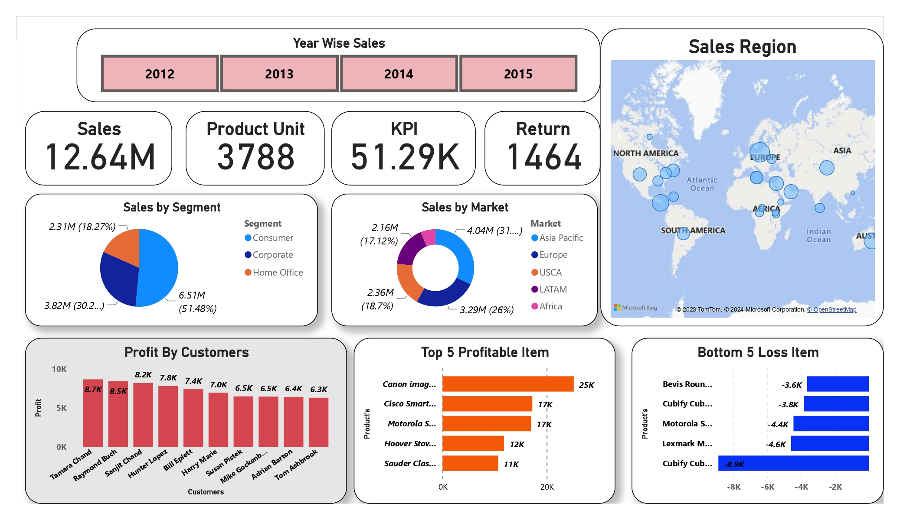

# Sales Report 
* Find out Sales as per Region .
* Find out Loss and Profit Margin as per Sales and find out Profitable Business .
* Disqualified item having Great Loss .
* Reviewed Sales of 4 years and slotted as the product .
* Analyze Data of Four Years

# Assets

- [Data](./Flipkart%20Data.xlsx)

- [PowerBI Report](./Sales%20Report%20Flipkart.pbix)

# Report

